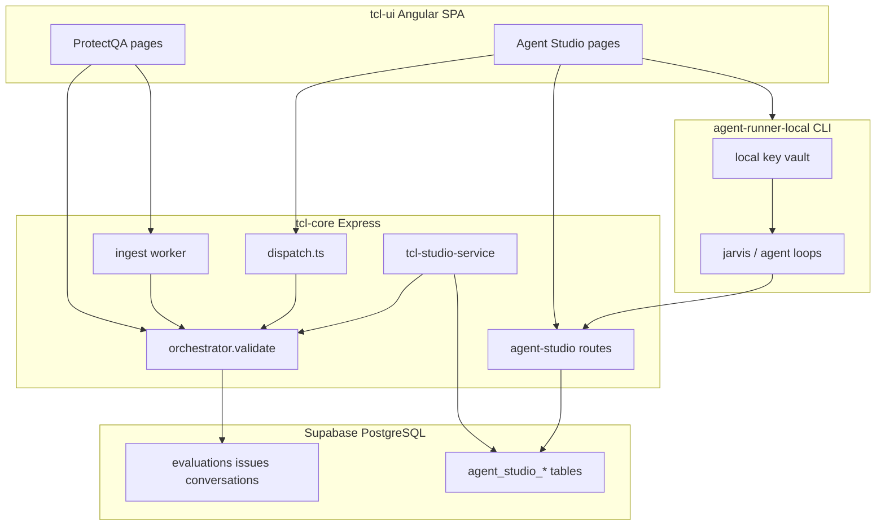

# TCL / ProtectQA — Developer Handoff

> **Purpose of this document:** Give any developer (or AI session) enough context to continue building without re-discovering the codebase.  
> **Repo root:** `/Users/kassihamilton/tcl-ai/tcl` (git root: `/Users/kassihamilton/tcl-ai`)  
> **Last updated:** May 2026

---

## Table of contents

1. [What the product is](#1-what-the-product-is)
2. [Monorepo structure](#2-monorepo-structure)
3. [ProtectQA — conversation analysis](#3-protectqa--conversation-analysis)
4. [Agent Studio — agent developer platform](#4-agent-studio--agent-developer-platform)
5. [TCL analysis on agent work](#5-tcl-analysis-on-agent-work)
6. [Agent launching & execution](#6-agent-launching--execution)
7. [BYOK & per-agent model routing](#7-byok--per-agent-model-routing)
8. [Database migrations](#8-database-migrations)
9. [API surface](#9-api-surface)
10. [UI routes](#10-ui-routes)
11. [Environment variables](#11-environment-variables)
12. [Local development](#12-local-development)
13. [Architecture diagrams](#13-architecture-diagrams)
14. [Wired vs stubbed](#14-wired-vs-stubbed)
15. [Recent / in-progress work](#15-recent--in-progress-work)
16. [Suggested code paths to trace](#16-suggested-code-paths-to-trace)
17. [Related documentation](#17-related-documentation)

---

## 1. What the product is

**TCL (Conversation Truth & Risk Intelligence)** is the analysis engine. **ProtectQA** is the product surface built on TCL.

TCL is **not** an “agent training score.” It answers:

1. Who said it (human, AI, system)?
2. What was claimed?
3. Was it true **and** appropriately supported?
4. Was it compliant with policy and consistent across the conversation?
5. What should happen next (compliance, AI policy, KB, product — not coaching only)?

> *TCL turns conversations into defensible truth, compliance, drift, hallucination, and business-value intelligence.*

### Two major product areas in one app

| Area | Purpose | UI namespace |
|------|---------|--------------|
| **ProtectQA** | Ingest and analyze human/AI conversations for compliance, risk, and audit | `/dashboard`, `/ingest`, `/evaluations`, `/issues`, … |
| **Agent Studio** | Create teams of AI agents, kanban work, Jarvis orchestrator, IDE dispatch, autonomous runs | `/agent-studio/**` |

Both share:

- Supabase auth + org/project RBAC
- The same `validate()` analysis engine
- The same `tcl-core` Express backend

---

## 2. Monorepo structure

npm workspaces (`tcl/package.json`):

| Package | Path | Role |
|---------|------|------|
| **tcl-core** | `packages/tcl-core` | Backend Express server, `validate()` engine, ProtectQA APIs, all Agent Studio server logic |
| **tcl-ui** | `packages/tcl-ui` | Angular 17 SPA (ProtectQA + Agent Studio UI) |
| **tcl-sdk** | `packages/tcl-sdk` | Publishable npm wrapper re-exporting `validate` + studio helpers |
| **tcl-integrations** | `packages/tcl-integrations` | Outbound connectors (Slack alerts, webhooks) |
| **tcl-nlp** | `packages/tcl-nlp` | Optional spaCy-backed entity extraction microservice |
| **tcl-nli-*** | `tcl-nli-service`, `tcl-nli-hf`, `tcl-nli-local` | NLI scoring services (graph/truth pipeline) |
| **tcl-browser-runner** | `packages/tcl-browser-runner` | Standalone browser UI for Agent Studio TCL live feed (SSE) |
| **agent-core** | `packages/agent-core` | Role/workflow/pack JSON templates + generic markdown assets |
| **agent-context** | `packages/agent-context` | Context store contracts + in-memory adapter |
| **agent-orchestrator** | `packages/agent-orchestrator` | Orchestrator gateway **interface** + noop implementation |
| **agent-workflows** | `packages/agent-workflows` | Workflow template contracts |
| **agent-integrations** | `packages/agent-integrations` | Jira/Azure adapter **contracts** + noop |
| **agent-mcp** | `packages/agent-mcp` | MCP descriptor/client **contracts** + noop |
| **agent-model-router** | `packages/agent-model-router` | Pure routing resolution types (runtime lives in tcl-core) |
| **agent-runner-local** | `packages/agent-runner-local` | CLI local execution plane (`pair`, `add-key`, `start`) |

**Important convention:** Real behavior lives in **tcl-core**. The `agent-*` packages are mostly boundary contracts and stubs so boundaries exist for future extraction.

```
tcl-ui  ──HTTP──►  tcl-core (Express)
                      ├── orchestrator.ts          validate()
                      ├── server/ingest/worker.ts  batch ingest → validate()
                      ├── server/agent-studio/*    Agent Studio API
                      └── studio/*                 agent artifact → validate mapping

agent-runner-local  ──Bearer──►  tcl-core /api/agent-studio/local-runner/*
tcl-browser-runner  ──SSE──────►  tcl-core /api/agent-studio/tcl/*
```

**Build:**

```bash
cd tcl
npm install
npm run build    # tcl-core then tcl-ui
npm run test
npm run typecheck
```

---

## 3. ProtectQA — conversation analysis

### Purpose

Help organizations:

- **Monitor** customer service and AI interactions for compliance
- **Detect** policy violations, contradictions, hallucinations, unsupported claims
- **Maintain** audit trails for legal defensibility
- **Track** issue resolution (decisions, signoffs, cases)
- **Export** audit-grade reports
- **Batch process** large volumes from files or cloud storage

### Primary use cases

1. Call center QA  
2. Compliance monitoring  
3. Risk management and escalation  
4. Audit preparation  
5. Batch / scheduled ingestion from S3, Dropbox, GDrive, etc.

### Core analysis engine

| File | Purpose |
|------|---------|
| `packages/tcl-core/src/orchestrator.ts` | **`validate(input)`** — full graph/truth pipeline |
| `packages/tcl-core/src/graph/` | Semantic graph, claims, contradictions |
| `packages/tcl-core/src/nlp/` | Entity extraction, spaCy client |
| `packages/tcl-core/src/server/ingest/worker.ts` | Background jobs: normalize → `validate()` → persist |
| `packages/tcl-core/src/server/ingestion/` | Batch upload, scheduled ingestion, parsers |
| `packages/tcl-core/src/server/issues/` | Issue CRUD, decisions, signoffs, snapshots, locks |
| `packages/tcl-core/src/server/exports/` | Audit pack ZIP generation |

### HTTP entry points (ProtectQA)

Registered in `packages/tcl-core/src/server/express.ts`:

| Endpoint | Purpose |
|----------|---------|
| `POST /validate` | Single conversation analysis |
| `POST /validate/batch` | Batch analysis |
| `POST /api/ingest` | Single file ingestion |
| `POST /api/ingest/batch/upload` | ZIP / JSONL / CSV batch upload |
| `GET/POST /api/ingest/sources`, `/schedules` | Scheduled cloud ingestion |
| `GET /api/evaluations`, `/issues`, `/cases`, … | CRUD + governance |
| `POST /api/audit-packs/generate` | Audit pack export |

### Ingest → analyze flow

```
Upload / scheduled job / connector batch
  → ingest/worker.ts (or batch parsers)
    → normalize to canonical transcript
    → validate(input)                    [orchestrator.ts]
    → persist evaluation + issues        [Supabase]
    → optional webhooks / integrations
```

### ProtectQA UI pages

| Route | Purpose |
|-------|---------|
| `/dashboard` | Main dashboard |
| `/call-center-qa`, `/original-qa` | QA workflows |
| `/ingest` | Single file upload |
| `/bulk-ingest` | Batch upload + connector browsers |
| `/bulk-ingest/scheduled` | Data sources + recurring schedules |
| `/evaluations`, `/evaluations/:id` | Analysis results |
| `/issues` | Compliance issues list |
| `/compliance` | Compliance dashboard |
| `/evidence`, `/evidence/:id` | Evidence / policy library |
| `/cases`, `/cases/:id` | Issue grouping for investigation |
| `/audit-packs` | Audit pack generation |
| `/integrations` | Jira, webhooks |
| `/admin`, `/admin/scoring` | Admin + scoring profiles |
| `/account`, `/profile`, `/onboarding` | User/org management |

### Key database tables (ProtectQA)

- `organizations`, `org_members`, `profiles`, `org_entitlements`
- `conversations`, `evaluations`, `conversation_artifacts`
- `issues`, `issue_decisions`, `issue_signoffs`, `issue_snapshots`, `issue_locks`
- `cases`, `case_issues`
- `evidence`, `templates`, `scoring_profiles`
- `ingestion_jobs`, `ingestion_batches`, `ingest_imports`, `ingest_sources`, `ingest_schedules`
- `enterprise_integrations`, `webhook_deliveries`, `exports`

See `docs/APPLICATION_OVERVIEW.md` for exhaustive schema and API detail.

---

## 4. Agent Studio — agent developer platform

### Purpose

Build and operate **teams of AI agents** inside ProtectQA:

- Teams of specialists + one **Jarvis** orchestrator per team
- Kanban board, tasks, review gates
- Agent personas, 12 markdown config files per agent
- Shared team context + mistake/rule registry
- Multi-vendor model routing + BYOK
- Human-in-the-loop pause controls (org / team / agent)
- IDE with Monaco + dispatch terminal
- Autonomous team runs (local runner execution plane)
- TCL analysis on agent outputs

**Spec:** `docs/specs/agent-studio.md`  
**Tracker:** `docs/agent-studio/implementation-progress.md`

### Core concepts

| Entity | Description |
|--------|-------------|
| **Team** | Group of agents + one kanban board |
| **Jarvis** | Orchestrator agent (`is_orchestrator=true`, role `agent_manager`) |
| **Agent** | Specialist with role template, markdown files, model routing |
| **Board / task** | Kanban columns, work items, review gates |
| **Team run** | Autonomous execution job (control plane on server) |
| **Local runner** | Execution plane on user's machine (keys stay local) |
| **Provider key (BYOK)** | Encrypted org-level API secret |
| **Model routing** | Which vendor/model/key each agent uses per use case |

### Team-in-a-box presets

`packages/tcl-core/src/server/agent-studio/team-box.ts`

Preset teams (mobile app, web app, AI product, **gaming_dev**, etc.) that provision Jarvis + role-matched specialists from template packs.

### Jarvis

| File | Role |
|------|------|
| `jarvis.ts` | `provisionJarvisForTeam`, `getJarvisAgentId`, seed markdown |
| `jarvis-llm-plan.ts` | LLM work breakdown (`llmJarvisWorkPlan`, `buildJarvisWorkPlanWithLlm`) |
| `team-intake.ts` | Template fallback planning, team box recommendation, game-driven plans |
| `agent-runner-local/src/jarvis-loop.ts` | Local runner Jarvis tick: board + JSONL → LLM → actions |

**Plan with Jarvis:**

```
POST /api/agent-studio/teams/:teamId/plan-work
  → applyJarvisWorkPlan (team-box-routes.ts)
    → buildJarvisWorkPlanWithLlm
      → if Jarvis has model + BYOK: llmJarvisWorkPlan (useCase: 'plan')
      → else: buildJarvisWorkPlan (template-based)
    → insert kanban tasks from plan items
```

### Agent markdown files (migration 050)

Each agent gets 12 seeded `.md` files (`agent.md`, `persona.md`, `instructions.md`, …).

- Assets: `packages/agent-core/templates/assets/generic/*.md`
- Packs: `packages/agent-core/templates/packs/*/pack.json`
- Composer: `prompt-composer.ts` — assembles system prompt for dispatch
- Prebuild embeds catalog: `scripts/embed-agent-catalog.mjs`, `embed-generic-agent-files.mjs`

### Key server modules

All under `packages/tcl-core/src/server/agent-studio/`:

| Module | Role |
|--------|------|
| `routes.ts` | Main router: teams, agents, board, BYOK, dispatch, pause, audit |
| `team-box-routes.ts` | Team-in-a-box create, plan-work, start-working |
| `dispatch.ts` | Cloud LLM dispatch (BYOK + routing + pause gate) |
| `model-routing.ts` | AGENT → TEAM → ORG resolution, per-agent config |
| `llm-completion.ts` | Server-side completion helper |
| `prompt-composer.ts` | Prompt assembly from agent files + context |
| `autonomous-routes.ts` | Team runs, events, local runner pairing |
| `local-runner-routes.ts` | Runner poll/claim, board mutations, loops |
| `tcl-studio-service.ts` | TCL analysis scheduling + SSE |
| `tcl-patch-proposals.ts` | TCL findings → reviewable markdown patches |
| `agent-files.ts` | Seed/manage agent markdown files |
| `agent-removal.ts` | Remove specialists, reassign tasks to Jarvis |
| `runtime-readiness.ts` | Command center “AI runtime” card |
| `crypto.ts` | AES-256-GCM for BYOK keys |
| `audit.ts` | `agent_studio_audit_logs` writer |

### Agent Studio UI

Base: `packages/tcl-ui/src/app/agent-studio/`  
Service: `agent-studio.service.ts`

| Route | Page |
|-------|------|
| `/agent-studio` | Overview dashboard |
| `/agent-studio/teams` | Teams list + create from team box |
| `/agent-studio/teams/:id` | Command center (runtime, plan, start working) |
| `/agent-studio/teams/:id/board` | Kanban board |
| `/agent-studio/teams/:id/agents` | Agents list, **Model & key**, markdown files |
| `/agent-studio/teams/:id/ide` | Monaco IDE + dispatch terminal |
| `/agent-studio/teams/:id/jarvis` | Jarvis orchestrator view |
| `/agent-studio/teams/:id/context` | Shared team context |
| `/agent-studio/teams/:id/rules` | Mistake / rule registry |
| `/agent-studio/teams/:id/tcl` | TCL live feed (team-scoped) |
| `/agent-studio/tcl` | TCL live feed (org-scoped) |
| `/agent-studio/vendors` | Local runner pairing + vendor registration |
| `/agent-studio/settings` | BYOK keys, model routing, org settings |
| `/agent-studio/templates/**` | Template packs, roles, personas, files |
| `/agent-studio/integrations` | Jira / Azure / custom integrations |

---

## 5. TCL analysis on agent work

The same `validate()` engine analyzes agent outputs — not just call-center transcripts.

### Key files

| File | Purpose |
|------|---------|
| `studio/run-studio-analysis.ts` | `runStudioTclAnalysis()` |
| `studio/map-agent-work.ts` | Map agent artifacts ↔ validate input/output |
| `tcl-studio-service.ts` | Create analysis rows, schedule, SSE events |
| `tcl-studio-routes.ts` | HTTP + SSE live feed |
| `tcl-patch-proposals.ts` | Generate markdown patch proposals from findings |

### Triggers (wired)

- After **IDE dispatch** (`dispatch.ts` → `scheduleTclAnalysisForDispatch`)
- After **agent run complete**
- After **Jarvis step** on local runner
- Manual: `POST /api/agent-studio/teams/:teamId/tcl/analyze`

### Flow

```
Trigger (dispatch | run | jarvis step | manual)
  → tcl-studio-service.ts (row status RUNNING)
    → runStudioTclAnalysis()
      → mapStudioArtifactToValidateInput
      → validate()
      → mapValidateOutputToStudioReport
    → finish row (SUCCEEDED/FAILED)
    → SSE to live feed (/api/agent-studio/tcl/stream)
    → optional patch proposals
```

Patch proposals are **markdown suggestion files** under `.tcl/fixes/{analysisId}/` — reviewable, not auto-applied to git.

**Standalone viewer:** `packages/tcl-browser-runner`

---

## 6. Agent launching & execution

There are **three ways** agents call models:

### A. Cloud dispatch (server BYOK)

Best for: IDE terminal, server-side Jarvis LLM planning, quick tests without local runner.

```
UI or API
  → POST /api/agent-studio/dispatch
    → readPauseGate (org / team / agent)
    → resolveModelRouting (per agent, use case)
    → decrypt provider key (AGENT_STUDIO_ENC_KEY)
    → call vendor API (OpenAI, Anthropic, Groq, Ollama, Azure, custom)
    → optional TCL analysis on response
```

UI: **Team IDE** → terminal dispatches via `agent-studio.service.ts`.

Supported providers in `dispatch.ts`: `openai`, `anthropic`, `groq`, `azure-openai` (metadata), `ollama`, `custom` (openaiBaseUrl metadata).

### B. Local runner (default for autonomous runs)

Best for: **Start Working**, autonomous team runs, keeping API keys on your machine.

**Control plane** on ProtectQA server; **execution plane** on your machine.

```bash
# 1. In browser: Agent Studio → Vendors & Runtime → Generate pairing code

# 2. On your machine:
npx @protectqa/agent-runner-local setup
npx @protectqa/agent-runner-local pair
npx @protectqa/agent-runner-local login      # Bearer token from browser session
npx @protectqa/agent-runner-local add-key openai
npx @protectqa/agent-runner-local register-vendors
npx @protectqa/agent-runner-local start      # leave running

# 3. In browser: Command center → Start Working / Launch run
```

Key CLI files: `packages/agent-runner-local/src/cli.ts`, `runner-loop.ts`, `jarvis-loop.ts`, `agent-loop.ts`, `model-client.ts`, `local-key-vault.ts`.

Plaintext API keys **never** sent to cloud — only vendor metadata refs.

### C. Plan with Jarvis (board planning)

Uses cloud BYOK on **Jarvis's** assigned model when configured; otherwise template specs/stories only.

Check command center **AI runtime** card: `planningUsesLlm` is true when Jarvis has routing + BYOK key.

---

## 7. BYOK & per-agent model routing

### Two-step model

1. **Store the API secret** (org-level, encrypted)
2. **Assign vendor + model + key per agent**

Agents do **not** store raw secrets — they reference org-level encrypted keys via routing rules.

### Server requirement

`AGENT_STUDIO_ENC_KEY` must be set on **tcl-core** (32-byte secret, hex or base64). Keys are encrypted at rest with AES-256-GCM. Saving keys fails without this env var.

Generate:

```bash
node -e "console.log(require('crypto').randomBytes(32).toString('base64'))"
```

### UI setup

| Step | Where |
|------|-------|
| Add provider key | **Agents page** → “Add provider key (BYOK)” panel, or **Studio settings → Provider keys** |
| Assign to agent | **Agents** → agent card → **Model & key** → provider, model, select key → Save |

Staff role (Owner/Admin/Manager) required to create keys.

### Routing resolution

Table: `agent_studio_model_routing`

Resolution order: **AGENT → TEAM → ORG → default**, with use-case fallback to `default`.

Use cases: `default`, `orchestrate`, `plan`, `spec`, `code`, `review`, `qa`, `security`, `research`, `summarize`, `tool_use`, `context_update`, `chat`.

Saving an agent's model config creates AGENT-scoped rules:

- **Jarvis:** `default`, `orchestrate`, `plan`, `review`
- **Specialists:** `default`, `code`, `chat`

API:

- `GET/PUT /api/agent-studio/agents/:agentId/model-config`
- `POST /api/agent-studio/provider-keys`
- `POST /api/agent-studio/model-routing/preview`

### Provider-specific metadata

| Provider | Extra config on provider key |
|----------|------------------------------|
| Azure OpenAI | `metadata.azureEndpoint` |
| Custom | `metadata.openaiBaseUrl` or `baseUrl` |

---

## 8. Database migrations

Apply in order under `supabase/sql/`.

### ProtectQA (earlier migrations)

Core tables for conversations, evaluations, issues, ingest, etc. See `docs/APPLICATION_OVERVIEW.md`.

### Agent Studio (045–056)

| # | File | Purpose |
|---|------|---------|
| **045** | `045_agent_studio.sql` | MVP: teams, agents, boards, tasks, review gates, contexts, mistakes, provider keys, model routing, MCP, integrations, audit logs + RLS |
| **046** | `046_agent_studio_entitlements.sql` | Historical `agentStudio` entitlement flag (**API no longer gates on this**) |
| **050** | `050_agent_studio_agent_files_and_template_packs.sql` | Template packs, role/persona templates, agent markdown files + versions |
| **051** | `051_agent_studio_board_settings.sql` | `agent_studio_boards.settings` JSONB (swimlanes, review policy) |
| **052** | `052_agent_studio_autonomous_runs.sql` | Team runs, agent runs, run steps, team event log, local runners, vendor refs |
| **053** | `053_agent_studio_runner_security.sql` | Runner auth token hashes, team context summaries, patch proposals |
| **054** | `054_agent_studio_tcl_analysis.sql` | `agent_studio_tcl_analyses` |
| **055** | `055_agent_studio_tcl_patches.sql` | Patch proposal FK to TCL analyses |
| **056** | `056_agent_studio_gaming_dev_pack.sql` | Seeds `gaming_dev` template pack |

API returns `migrationRequired` / 503 when schema is missing — apply migrations before testing autonomous runs, agent files, or TCL analysis.

---

## 9. API surface

Central registration: `packages/tcl-core/src/server/express.ts`

### ProtectQA

- `POST /validate`, `POST /validate/batch`
- `/api/ingest/**`, `/api/evaluations/**`, `/api/issues/**`, `/api/cases/**`
- `/api/audit-packs/**`, `/api/integrations/**`, `/api/connectors/**`
- `/api/me`, `/api/entitlements`, org/project/member APIs
- Billing (Stripe), webhooks

### Agent Studio (`setupAgentStudioRoutes`)

| Module | Examples |
|--------|----------|
| `routes.ts` | `/teams`, `/agents`, `/board`, `/tasks`, `/provider-keys`, `/model-routing`, `/dispatch`, pause/resume |
| `team-box-routes.ts` | `/team-boxes`, `/teams/from-box`, `/plan-work`, `/start-working` |
| `autonomous-routes.ts` | `/team-runs`, `/team-events`, `/local-runners`, `/model-routing/preview` |
| `local-runner-routes.ts` | `/local-runner/jobs/poll`, board mutations, TCL jarvis-step |
| `tcl-studio-routes.ts` | `/tcl/stream`, `/tcl/live-feed`, `/teams/:teamId/tcl/analyze` |
| `patch-proposal-routes.ts` | `/teams/:teamId/patches/**` |
| `agent-studio-template-file-routes.ts` | Template packs, agent files CRUD, prompt preview |

Auth: session + org context via `getOrgContext`. RBAC enforced per route (staff vs analyst).

---

## 10. UI routes

### ProtectQA

See `packages/tcl-ui/src/app/app.routes.ts` — full list in [§3 ProtectQA UI pages](#protectqa-ui-pages).

### Agent Studio

See `packages/tcl-ui/src/app/agent-studio/agent-studio.routes.ts` — full list in [§4 Agent Studio UI](#agent-studio-ui).

Auth: `AuthGuard` on protected routes. Plan gating via `PlanGuard` on some ProtectQA routes.

---

## 11. Environment variables

### tcl-core (backend)

| Variable | Purpose |
|----------|---------|
| `SUPABASE_URL`, `SUPABASE_SERVICE_ROLE_KEY` | Database + storage |
| `AGENT_STUDIO_ENC_KEY` | Encrypt BYOK provider keys (**required for cloud keys**) |
| `PORT` | Server port (default 8787) |
| `TCL_NLP_URL`, `ENABLE_SPACY` | Optional spaCy NLI service |
| `OLLAMA_BASE_URL` | Ollama dispatch default |
| Stripe keys | Billing |

### tcl-ui (frontend)

| Variable | Purpose |
|----------|---------|
| `__TCL_API_URL` / proxy config | API base URL |
| Supabase anon key | Auth (embedded at build for Netlify) |

### agent-runner-local

| Variable | Purpose |
|----------|---------|
| `TCL_API_URL` | Point at your API host |
| `PROTECTQA_AUTH_TOKEN` | Bearer for cloud sync |
| `PROTECTQA_VAULT_PASSPHRASE` | Encrypt local key vault at rest |

---

## 12. Local development

```bash
# From tcl/
npm install
npm run build

# Backend
cd packages/tcl-core && npm run dev

# Frontend
cd packages/tcl-ui && npm start

# Optional: spaCy NLP
cd packages/tcl-nlp && uvicorn app.main:app --reload --port 8081

# Optional: local runner (after pairing in UI)
cd packages/agent-runner-local && npm run build
npx @protectqa/agent-runner-local start
```

**Before Agent Studio features:** Apply Supabase migrations 045–056 (at minimum 045 + 050 + 052 + 054 for files, runs, TCL).

**Before cloud BYOK:** Set `AGENT_STUDIO_ENC_KEY` on tcl-core.

---

## 13. Architecture diagrams

### High-level



### ProtectQA ingest → analyze

```
Upload / schedule / connector
  → worker.ts or batch parsers
  → canonical transcript
  → validate()
  → evaluations + issues (Supabase)
```

### Agent autonomous run

```
UI: Start Working
  → POST /teams/:id/runs (agent_studio_team_runs)
  → local runner polls /local-runner/jobs/poll
  → jarvis-loop.ts / agent-loop.ts
  → board mutations via /local-runner/tasks/*
  → team event log (JSONL)
  → optional TCL on jarvis step
```

---

## 14. Wired vs stubbed

| Feature | Status |
|---------|--------|
| TCL `validate()` engine | **Wired** |
| ProtectQA ingest (single, batch, scheduled) | **Wired** |
| Issues, decisions, signoffs, cases, audit packs | **Wired** |
| Agent Studio CRUD, board, pause, audit | **Wired** |
| Agent markdown files (12 per agent) | **Wired** (needs migration 050) |
| Cloud dispatch + BYOK + per-agent routing | **Wired** |
| Jarvis LLM planning (template fallback) | **Wired** |
| TCL on dispatch / runs / Jarvis steps | **Wired** |
| Patch proposals from TCL | **Wired** (markdown, not auto git apply) |
| Local runner pair + autonomous loops | **Wired** |
| MCP servers | **DB + CRUD only** — no real tool calls |
| Jira / Azure integrations | **Ping only** — no full sync |
| `agent-orchestrator` package | Interface + noop |
| Full cloud autonomous loop without runner | **Not built** |
| Agent billing / marketplace | **Not built** |
| BullMQ job queue | **Deferred** |
| Gaming dev pack in UI pack picker | **Partial** — backend + SQL 056; UI may omit `gaming_dev` in PACK_KEYS |

---

## 15. Recent / in-progress work

Work from recent sessions (may be uncommitted — check `git status`):

- **Per-agent model config:** `model-routing.ts`, `llm-completion.ts`, `GET/PUT .../agents/:id/model-config`
- **Agents UI:** Model & key tab, BYOK banner, inline add-key panel
- **Jarvis LLM planning:** `jarvis-llm-plan.ts`, wired in `team-box-routes.ts`
- **Model routing preview fix:** wrong table name corrected in `autonomous-routes.ts`
- **Runtime readiness:** `planningUsesLlm` on command center
- **Agent removal:** `agent-removal.ts`, removal-impact API, UI dialog
- **Gaming dev team box:** `team-box.ts`, `team-intake.ts`, SQL 056, pack JSON
- **Generic agent file embedding:** `embed-generic-agent-files.mjs`, `generated-agent-generic-files.ts`
- **Vendors & Runtime UI:** install guide, npm package explanation

---

## 16. Suggested code paths to trace

### New to ProtectQA analysis

1. `POST /validate` in `express.ts`
2. `packages/tcl-core/src/orchestrator.ts`
3. `packages/tcl-core/src/server/ingest/worker.ts`

### New to Agent Studio

1. Create team: `team-box-routes.ts` → `provisionTeamBox` → `jarvis.ts`
2. Assign models: Agents UI → `model-routing.ts`
3. Plan work: `jarvis-llm-plan.ts` → `team-intake.ts` (fallback)
4. Dispatch: `dispatch.ts` → `prompt-composer.ts`
5. Autonomous: `autonomous-routes.ts` → `agent-runner-local/jarvis-loop.ts`

### End-to-end agent + TCL

1. Settings or Agents → add BYOK key
2. Agents → Jarvis → Model & key
3. Command center → Plan with Jarvis
4. Vendors & Runtime → pair local runner
5. Start Working → runner picks up job
6. IDE dispatch → TCL analysis → live feed

---

## 17. Related documentation

| Document | Contents |
|----------|----------|
| [`README.md`](../README.md) | Product one-liner, packages, quick start |
| [`docs/APPLICATION_OVERVIEW.md`](./APPLICATION_OVERVIEW.md) | Exhaustive ProtectQA schema, APIs, data flows |
| [`docs/specs/agent-studio.md`](./specs/agent-studio.md) | Agent Studio product spec |
| [`docs/agent-studio/implementation-progress.md`](./agent-studio/implementation-progress.md) | MVP checklist |
| [`docs/agent-studio/generic-agent-file-system.md`](./agent-studio/generic-agent-file-system.md) | 12-file agent system |
| [`docs/agent-studio/template-packs.md`](./agent-studio/template-packs.md) | Template pack model |
| [`packages/tcl-core/README.md`](../packages/tcl-core/README.md) | validate() API, scores, domain packs |
| [`packages/tcl-core/docs/PRODUCT_POSITIONING.md`](../packages/tcl-core/docs/PRODUCT_POSITIONING.md) | Five-question framework |
| [`packages/agent-runner-local/README.md`](../packages/agent-runner-local/README.md) | Local runner CLI |
| [`packages/tcl-sdk/README.md`](../packages/tcl-sdk/README.md) | External SDK usage |

---

*Update this document when major features ship or architecture changes.*
